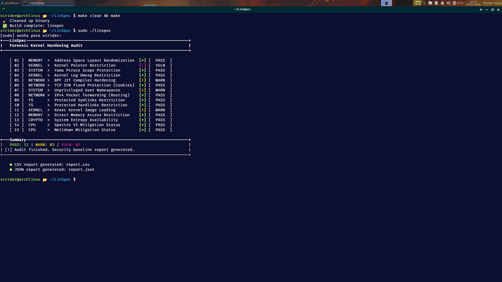
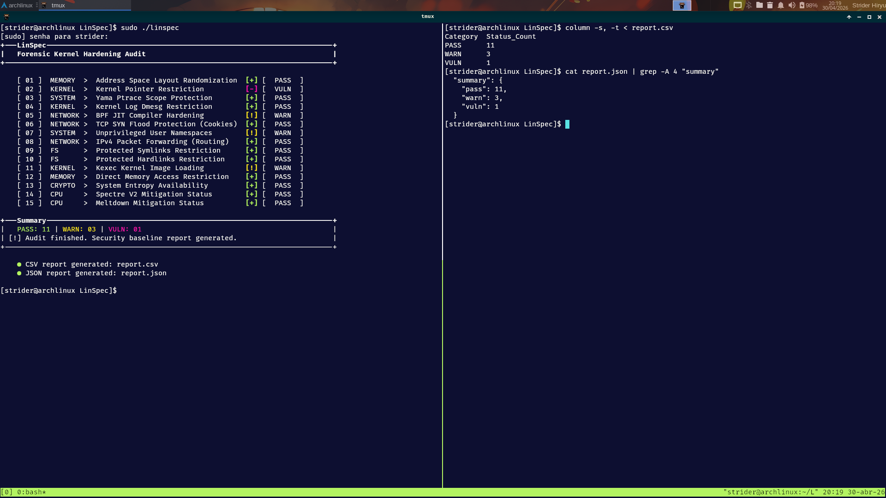
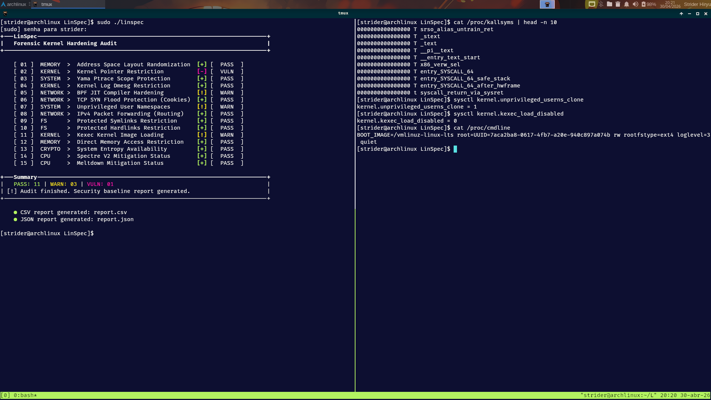

# 🐧 LinSpec

Lightweight kernel hardening audit tool for Linux forensic triage and security baseline verification.

[](https://kernel.org)
[](https://gcc.gnu.org/)
[](LICENSE)
[](#-roadmap)
[](https://security.archlinux.org/)
[](./docs/forensic_methodology.md)

---

## ● Overview

LinSpec is a specialized forensic utility designed to audit the security posture of the Linux Kernel in real-time.

It evaluates critical kernel parameters, hardware mitigations, and system-level protection flags to generate a structured security baseline report. It operates as the **forensic triage phase**, identifying weaknesses before deeper memory analysis.

**Core Audit Areas:**

* **Memory Protection:** `ASLR`, `NX`, and `DMA` restrictions
* **Kernel Hardening:** Pointer restrictions, `kexec` disabled, and `dmesg` visibility
* **CPU Mitigations:** Spectre and Meltdown status
* **Network Stack:** BPF JIT hardening and SYN Flood protection

---

## ● Features

* Real-time kernel auditing
* CPU vulnerability detection
* **Forensic Data Export (JSON/CSV)**
* Minimalist terminal UI
* Pure C99 (no dependencies)
* PASS / WARN / VULN classification
* Passive inspection (read-only)
* Stateless execution

---

## ● Example Output

```text
[ 01 ]  MEMORY   >  Address Space Layout Randomization     [+] [   PASS   ]
[ 02 ]  KERNEL   >  Kernel Pointer Restriction             [-] [   VULN   ]
[ 03 ]  SYSTEM   >  Yama Ptrace Scope Protection           [+] [   PASS   ]
[ 04 ]  KERNEL   >  Kernel Log Dmesg Restriction           [+] [   PASS   ]
[ 05 ]  NETWORK  >  BPF JIT Compiler Hardening             [!] [   WARN   ]
[ 06 ]  NETWORK  >  TCP SYN Flood Protection (Cookies)     [+] [   PASS   ]
[ 07 ]  SYSTEM   >  Unprivileged User Namespaces           [!] [   WARN   ]
```

---

## ● How It Works

LinSpec interfaces directly with:

* `/proc/sys`
* `/sys/devices`

Audit flow:

1. Collect kernel security parameters
2. Normalize and classify values
3. Compare against a hardened baseline
4. Assign PASS / WARN / VULN states
5. Export structured forensic reports

---

## ● Build and Run

```bash
# 1. Clone the repository
git clone https://github.com/jeffersoncesarantunes/LinSpec.git

# 2. Enter the directory
cd LinSpec

# 3. Compile the project
make clean && make

# 4. Run with root privileges for full access
sudo ./linspec
```

---

## ● Reports & Integration

After execution, LinSpec generates structured artifacts for external analysis:

* `report.json`: Machine-readable data for forensic pipelines
* `report.csv`: Tabular format for analysis and documentation

### ● Ecosystem Integration (S.I.R.E.N)

The generated `report.json` acts as a telemetry layer for the ecosystem:

* **Role:** Input source for **S.I.R.E.N**
* **Capability:** Enables adaptive memory acquisition
* **Benefit:** Automates forensic capture decisions

---

## ● The Forensic Ecosystem

LinSpec is the first component of a three-stage forensic workflow:

[-002B36?style=flat-square\&logo=linux\&logoColor=white)](#-linspec)
[-006400?style=flat-square\&logo=linux\&logoColor=white)](https://github.com/jeffersoncesarantunes/S.I.R.E.N)
[-003366?style=flat-square\&logo=linux\&logoColor=white)](https://github.com/jeffersoncesarantunes/K-Scanner)

---

## ● Technical Validation & Evidence

To confirm audit accuracy:

**1. Verifying Structured Reports:**

```bash
column -s, -t < report.csv
cat report.json | grep -A 4 "summary"
```

**2. Verifying Kernel Constraints:**

```bash
cat /proc/kallsyms | head -n 10
sysctl kernel.unprivileged_userns_clone
sysctl kernel.kexec_load_disabled
cat /proc/cmdline
```

---

## ● Project in Action


*1 - System Audit Overview. Execution of the forensic engine performing baseline triage.*


*2 - Data Integrity & Reporting. Validation between terminal output and structured reports.*


*3 - Forensic Kernel Validation. Cross-checking LinSpec results with live kernel state.*

---

## ● Repository Structure

```text
├── docs/
│   ├── architecture.md
│   ├── audit_reference.md
│   ├── forensic_methodology.md
│   └── threat_model.md
├── Imagens/
│   ├── linspec1.png
│   ├── linspec2.png
│   └── linspec3.png
├── include/
├── src/
│   ├── checks.h
│   ├── main.c
│   ├── memory_audit.c
│   └── system_audit.c
├── report.csv
├── report.json
├── LICENSE
├── Makefile
└── README.md
```

---

## ● Tech Stack

* **Language:** C (C99)
* **Data Sources:** `/proc` and `/sys`
* **Build Tool:** GNU Make
* **Target Platforms:** Linux Kernel 4.x, 5.x, 6.x

---

## ● Roadmap

* [x] High-performance C99 Core Engine
* [x] Side-channel Vulnerability Detection (Spectre/Meltdown)
* [x] Brutalist-inspired Terminal UI
* [x] Structured Output (JSON/CSV Export)
* [x] **Ecosystem Integration (Pre-acquisition Audit for S.I.R.E.N)**
* [ ] Automated Remediation (System Hardening)
* [ ] K-Scanner Deep Integration

---

## ● Documentation

[](./docs/architecture.md)
[](./docs/forensic_methodology.md)
[](./docs/audit_reference.md)
[](./docs/threat_model.md)

---

## ● Etymology & Origin

**LinSpec** derives from **Linux** + **Inspection (Specification)**.

The tool was conceptualized as a **forensic entry-point**, evaluating whether kernel-level protections are correctly enforced before deeper analysis begins.

---

## ● License

[](./LICENSE)

*This project is licensed under the MIT License.*
