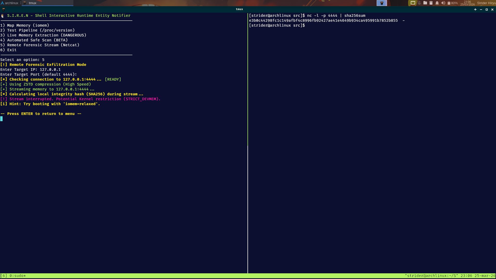

# 🐧 SYNTROPY

Unified Linux Incident Response Toolkit — Audit, Acquire, Analyze.

[](https://kernel.org)
[](https://gcc.gnu.org/)
[](https://www.gnu.org/software/bash/)
[](LICENSE)
[](#-roadmap)
[](https://security.archlinux.org/)
[](#-overview)

---

## ● Overview

**SYNTROPY** is an open-source forensic ecosystem composed of three specialized tools that work together to **audit, acquire, and analyze** volatile evidence on Linux systems under investigation.

Designed for **Blue Team / DFIR** professionals, the toolkit covers the full memory incident response lifecycle:

| Phase | Tool | Objective |
|-------|------|-----------|
| **1. Triage** | LinSpec | Audit kernel hardening posture and identify vulnerabilities |
| **2. Acquisition** | S.I.R.E.N | Extract memory dump with awareness of the active security profile |
| **3. Analysis** | K-Scanner | Detect processes with suspicious RWX memory regions in real-time |

**Key differentiators:**

* **Read-only operation** — no process injection, no kernel modification
* **Audit-aware acquisition** — adapts strategy based on active kernel protections
* **Cryptographic integrity** — SHA256 on every forensic artifact
* **Pure C99** (LinSpec, K-Scanner) and **Bash** (S.I.R.E.N) — zero external dependencies beyond system libraries

---

## ● Components

### 1. LinSpec — Kernel Hardening Audit

Audits critical Linux kernel security parameters in real-time, classifying each item as **PASS / WARN / VULN**.

**Audited areas:**

| Category | Parameters |
|----------|-----------|
| Memory | ASLR, devmem_restrict |
| Kernel | kptr_restrict, dmesg_restrict, kexec_load_disabled |
| CPU | Spectre v2, Meltdown |
| Network | BPF JIT hardening, TCP syncookies, IP forwarding |
| System | Ptrace scope, user namespaces, protected symlinks/hardlinks |

**Output:** Structured `report.json` + `report.csv`, consumed by S.I.R.E.N for adaptive acquisition decisions.

```bash
sudo ./linspec

# Sample output:
# [ 01 ]  MEMORY   >  ASLR                              [+] [   PASS   ]
# [ 02 ]  KERNEL   >  Kernel Pointer Restriction        [-] [   VULN   ]
# [ 12 ]  MEMORY   >  DMA Restriction                   [+] [   PASS   ]
# [ 15 ]  CPU      >  Meltdown Mitigation               [+] [   PASS   ]
```

### 2. S.I.R.E.N — Shell Interactive Runtime Entity Notifier

Volatile memory acquisition tool with contextual awareness. It reads LinSpec's `report.json` to automatically determine the best extraction strategy.

**Operation modes:**

| Option | Function | Source | Risk |
|--------|----------|--------|------|
| 1 | Map physical RAM | `/proc/iomem` | None |
| 2 | Verify pipeline | `/proc/version` | None |
| 3 | Live extraction | `/dev/mem` | Moderate |
| 4 | Forensic bypass | `/proc/kcore` | Low |

**Audit-aware behavior:**
- If `kptr_restrict > 0` → Automatically switches to `/proc/kcore`
- If `spectre_v2 = 0` or `meltdown = 0` → Warns about side-channel leaks during extraction
- If `devmem_restrict = 1` → Prefers `/proc/kcore`

```bash
sudo ./src/siren.sh
```

### 3. K-Scanner — Live Process Forensics

Scans all active processes through `/proc/[PID]/maps` looking for memory regions with **RWX (Read-Write-Execute)** permissions — a direct violation of the **W^X (Write XOR Execute)** principle.

**Detects patterns including:**
- `ANON_BLOB` — Anonymous executable region (shellcode, fileless malware)
- `JIT_ENGINE` — JIT compilation (Firefox, Python, Node.js, Discord)
- `VOLATILE_FS` — RWX in `/tmp` or `/dev/shm`
- `PROC_STACK` — Executable stack (exploit or insecure configuration)

```bash
sudo ./kscanner --json > alerts.json
```

**Interactive TUI:** Navigate processes, view real-time alerts, press `ENTER` to extract suspicious regions with automatic SHA256, strings, and hexdump generation.

---

## ● Features

* Full memory incident response lifecycle (triage → acquisition → analysis)
* Audit-aware acquisition strategy adaptive to kernel hardening level
* Real-time RWX memory violation detection
* Interactive ncurses-based forensic TUI
* Automatic SHA256 integrity chain on every artifact
* JSON/CSV structured forensic reports
* Modular architecture — each tool operates independently or integrated
* Zero external dependencies (C99 + system libraries)

---

## ● Example Output

```text
 PHASE 1 — LinSpec Audit:

 [ 01 ]  MEMORY   >  Address Space Layout Randomization     [+] [   PASS   ]
 [ 02 ]  KERNEL   >  Kernel Pointer Restriction             [-] [   VULN   ]
 [ 05 ]  NETWORK  >  BPF JIT Compiler Hardening             [!] [   WARN   ]

 PHASE 2 — S.I.R.E.N Acquisition:

 --> Address: 00001000-0009efff : System RAM [VALID]
 --> Address: 00100000-5aaeafff : System RAM [VALID]
 [+] Extraction via /proc/kcore — 32 GB acquired
 [+] SHA256: a1b2c3d4e5f6...

 PHASE 3 — K-Scanner Analysis:

 PID    PROCESS              STATUS          MAP_ADDR
 53220  suspicious-process   RWX ALERT       3ed35854000
 1132   python3              RWX ALERT       7fc163862000
 1426   Xorg                 SAFE            n/a
```

---

## ● How It Works

SYNTROPY integrates three tools that communicate through a shared forensic protocol (`report.json`):

```
┌─────────────────────────────────────────────────────────────────┐
│                          SYNTROPY                               │
├─────────────┬───────────────────┬───────────────────────────────┤
│   LinSpec   │     S.I.R.E.N     │          K-Scanner            │
│  (Auditor)  │  (Acquisitor)     │        (Analyzer)             │
├─────────────┼───────────────────┼───────────────────────────────┤
│ /proc/sys   │ /dev/mem          │ /proc/[PID]/maps              │
│ /sys/devices│ /proc/kcore       │ /proc/[PID]/mem               │
│             │ /proc/iomem       │                               │
├─────────────┼───────────────────┼───────────────────────────────┤
│      report.json ──────► audit-aware decision                   │
│             │                   │                               │
│             │   dumps/*.bin ◄───┘   RWX dump pipeline           │
│             │   dumps/*.sha256      │                           │
│             │   dumps/report_*.json │                           │
└─────────────┴───────────────────┴───────────────────────────────┘
```

**Data flow:**

1. **LinSpec** audits the kernel and produces `report.json`
2. **S.I.R.E.N** reads `report.json` → decides which memory interface to use → dumps memory
3. **K-Scanner** scans processes in real-time → flags RWX regions → extracts evidence if needed

---

## ● Quick Install

```bash
# Clone the unified toolkit
git clone https://github.com/jeffersoncesarantunes/SYNTROPY.git
cd SYNTROPY

# ---- LinSpec ----
cd LinSpec && make clean && make && cd ..

# ---- K-Scanner ----
cd K-Scanner && make clean && make && cd ..

# ---- SIREN ----
chmod +x SIREN/src/siren.sh

# Ready. Run as root:
sudo ./LinSpec/linspec
sudo ./SIREN/src/siren.sh
sudo ./K-Scanner/kscanner --help
```

**Prerequisites:** `gcc`, `make`, `ncurses`, `binutils`, `coreutils`, `bash 4.x+`, root privileges.

---

## ● Incident Response Workflow

```
INCIDENT DETECTED
       │
       ▼
┌──────────────────┐
│ PHASE 1: TRIAGE  │
│ LinSpec          │  < 1 second
│ "Is the kernel   │
│  hardened?"      │
└────────┬─────────┘
         │
         ▼
┌──────────────────┐
│ PHASE 2: ACQUIRE │
│ S.I.R.E.N        │  < 5 minutes
│ dump memory with │
│ integrity chain  │
└────────┬─────────┘
         │
         ▼
┌──────────────────┐
│ PHASE 3: ANALYZE │
│ K-Scanner        │  < 30 seconds
│ "Who has RWX?"   │
│ + strings + hex  │
└────────┬─────────┘
         │
         ▼
┌──────────────────┐
│ REPORT           │
│ Evidence with    │
│ cryptographic    │
│ chain of custody │
└──────────────────┘
```

---

## ● Detailed Usage

### Phase 1: Audit with LinSpec

```bash
cd LinSpec
sudo ./linspec
```

The report generated in `reports/report.json` is automatically consumed by S.I.R.E.N in the next phase.

**Flags to watch:**
- `kptr_restrict = 0` → Kernel pointers visible (information leak)
- `devmem_restrict = 0` → `/dev/mem` unrestricted (extraction risk)
- `spectre_v2 = 0` → CPU vulnerable to Spectre
- `bpf_jit_harden = 0` → BPF JIT without hardening

### Phase 2: Acquisition with S.I.R.E.N

```bash
cd SIREN
sudo ./src/siren.sh
```

Interactive menu:

```
1) Map Physical Memory (iomem)        → Lists valid RAM regions
2) Verify Extraction Pipeline         → Tests pipeline without extraction
3) Live Memory Extraction (/dev/mem)  → Extracts 100 MB via /dev/mem
4) Advanced Forensic Bypass (kcore)   → Extracts full RAM via /proc/kcore
5) Exit
```

**Production recommendation:** Option **4 (kcore)** — more stable, zero freeze risk.
**Option 3 (/dev/mem):** Only if kcore is unavailable.

### Phase 3: Analysis with K-Scanner

```bash
cd K-Scanner
sudo ./kscanner          # Interactive TUI mode
sudo ./kscanner --json   # JSON export (headless)
sudo ./kscanner --csv    # CSV export (headless)
```

**TUI controls:**
- Navigate processes with arrow keys
- **Red** rows = `RWX ALERT`
- **Green** rows = `SAFE`
- Press **ENTER** on a suspicious process → extracts RWX region
- Press **Q** to exit

**Live regex search across process memory:**
```bash
sudo ./kscanner --live <PID> "<regex>"
```

---

## ● Why

Incident response on Linux lacks a unified, audit-aware forensic pipeline. Most tools operate in isolation — a kernel auditor cannot communicate with a memory acquirer, and an RWX detector has no context of the system's protection state.

SYNTROPY solves this by:

* Connecting kernel audit data directly to acquisition decisions
* Providing a repeatable, three-phase forensic workflow
* Ensuring cryptographic integrity at every stage
* Operating with zero system modification
* Enabling production-safe evidence collection without downtime

It transforms raw kernel telemetry into a structured, court-ready forensic chain.

---

## ● Project in Action

  
*1 - Live forensic mode identifying RWX memory regions across active processes.*

  
*2 - Full memory acquisition with integrity verification and structured reporting.*

  
*3 - Cross-validation of kernel audit results against live system state.*

---

## ● Operational Integrity

SYNTROPY is designed for safe live-response environments:

* Read-only operation across all components
* No process injection or kernel modification
* Audit-aware fallback between memory interfaces
* Cryptographic integrity on every forensic artifact
* Graceful failure on restricted access
* Zero-downtime evidence collection in production

---

## ● Deployment

### Requirements

* Linux Kernel 5.x or newer
* gcc, make
* ncurses (K-Scanner)
* binutils, coreutils
* Bash 4.x+
* Root privileges
* UTF-8 compatible terminal

---

## ● Repository Structure

```text
SYNTROPY/
│
├── K-Scanner/               ← RWX process analysis
│   ├── src/                 ├── core/ (kscanner.c, mem_analyzer, process_hunter)
│   │                       ├── modules/ (tui_engine, export_engine, regex_engine)
│   │                       └── utils/ (logger, memory_utils)
│   ├── include/             ├── public headers
│   ├── scripts/             ├── build, test, diagnostic
│   ├── docs/                ├── architecture, threat model, methodology
│   └── Makefile
│
├── LinSpec/                 ← Kernel hardening audit
│   ├── src/                 ├── main.c, memory_audit.c, system_audit.c
│   ├── include/             ├── headers
│   ├── docs/                ├── technical documentation
│   └── Makefile
│
├── SIREN/                   ← Memory acquisition
│   ├── src/                 ├── siren.sh
│   ├── dumps/               ├── extracted artifacts (.bin, .sha256, manifest.csv)
│   ├── docs/                ├── acquisition model, safety model
│   └── .gitignore
│
├── README.md                ← This file
└── LICENSE
```

Each subdirectory maintains its own documentation and independent Makefile. The toolkit can be used both as an integrated suite or as standalone tools.

---

## ● Tech Stack

* **Core Language:** C99 (LinSpec, K-Scanner)
* **Acquisition Layer:** Bash 4.x+ (S.I.R.E.N)
* **Data Sources:** `/proc`, `/sys`, `/dev/mem`
* **Interface:** ncurses TUI (K-Scanner)
* **Hashing:** SHA256
* **Forensic Reports:** JSON / CSV
* **Build System:** GNU Make
* **Target:** Linux Kernel 5.x / 6.x

---

## ● Roadmap

* [x] Kernel hardening audit engine (LinSpec)
* [x] Audit-aware adaptive memory acquisition (S.I.R.E.N)
* [x] Real-time RWX detection with ncurses TUI (K-Scanner)
* [x] Cryptographic integrity chain (SHA256)
* [x] JSON/CSV structured forensic reporting
* [x] Cross-tool integration via `report.json` protocol
* [ ] Live regex memory hunting (K-Scanner)
* [ ] eBPF telemetry integration
* [ ] Automated remediation suggestions

---

## ● Documentation

[](./LinSpec/docs/architecture.md)
[](./S.I.R.E.N/docs/ACQUISITION_MODEL.md)
[](./K-Scanner/docs/forensic_methodology.md)
[](./K-Scanner/docs/threat_model.md)

---

## ● Etymology & Origin

The name **SYNTROPY** originates from the concept of **syntropy** — the opposite of entropy.

While entropy represents the tendency toward disorder and chaos, syntropy is the tendency toward order, organization, and structure in complex systems. This principle directly mirrors the purpose of an incident response toolkit: when a system is under attack — in a state of forensic chaos — SYNTROPY provides the methodology and tools to restore order, establish a clear chain of evidence, and bring structure to the investigation.

The name reflects the philosophy behind the project: **bringing organization to the chaos of a security incident** through a disciplined, audit-aware, cryptographically validated forensic pipeline.

---

## ● License

[](./LICENSE)

*This project is licensed under the MIT License. Each subproject (K-Scanner, LinSpec, S.I.R.E.N) also maintains its own license under the same terms.*
