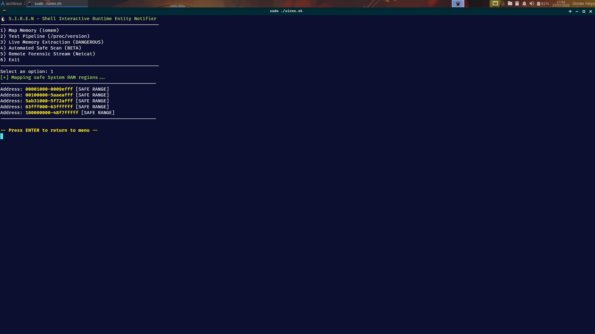
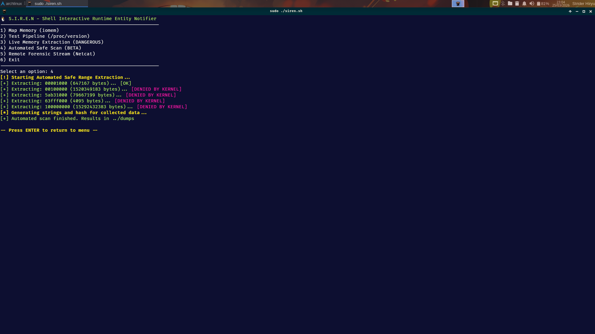

# 🐧 S.I.R.E.N

Linux memory acquisition tool with audit-aware forensic triage.

[](https://kernel.org)
[](https://www.gnu.org/software/bash/)
[](LICENSE)
[](#-roadmap)
[](https://security.archlinux.org/)
[](./docs/SAFETY_MODEL.md)

---

## ● Etymology & Origin

**S.I.R.E.N** stands for **S**hell **I**nteractive **R**untime **E**ntity **N**otifier. The name reflects its role as a runtime memory acquisition tool that actively monitors, identifies, and notifies analysts about forensic entities during live system execution — like a siren that sounds when memory artifacts require attention.

---

## ● Overview

S.I.R.E.N is a specialized forensic utility designed for controlled memory acquisition and integrity validation on Linux systems.

It integrates with **LinSpec** to perform **audit-aware acquisitions**, adapting its extraction strategy based on detected kernel hardening levels and runtime protections.

**Core Capabilities:**

* **Audit-Aware Acquisition:** Uses LinSpec reports (`report.json`) to guide extraction strategy
* **Safe Memory Mapping:** Identifies valid System RAM regions via `/proc/iomem`
* **Adaptive Source Selection:** Automatically switches between `/dev/mem` and `/proc/kcore`
* **Integrity Validation:** Detects restricted or null-filled memory regions
* **Forensic Artifacts:** Generates SHA256 hashes, strings, and structured reports

---

## ● Features

* SHA256 integrity verification
* Automatic JSON forensic reports
* CSV manifest logging
* On-demand string extraction
* Pre-acquisition disk space validation
* Safe-range mapping via `/proc/iomem`
* Support for `/dev/mem` and `/proc/kcore`

---

## ● Example Output

```bash id="sirx1a"
# SIREN Output: Mapping System RAM
[+] Mapping Physical System RAM regions...

--> Address: 00001000-0009efff : System RAM [VALID]
--> Address: 00100000-5aaeafff : System RAM [VALID]
```

---

## ● How It Works

S.I.R.E.N interfaces with:

* `/proc/iomem`
* `/dev/mem`
* `/proc/kcore`

Acquisition flow:

1. Load LinSpec audit data (`report.json`)
2. Map valid System RAM regions via `/proc/iomem`
3. Select acquisition source (`/dev/mem` or `/proc/kcore`)
4. Validate memory integrity (NULL-byte detection)
5. Generate forensic artifacts (hashes, strings, reports)

---

## ● Execution

```bash id="sirrun1"
# 1. Clone the repository
git clone https://github.com/jeffersoncesarantunes/S.I.R.E.N.git

# 2. Enter the directory
cd S.I.R.E.N

# 3. Grant execution permissions
chmod +x src/siren.sh

# 4. Run with root privileges
sudo ./src/siren.sh
```

---

## ● Investigation & Post-Acquisition Workflow

### 1. Integrity Verification

```bash id="sirval1"
sha256sum -c dumps/*.bin.sha256
```

### 2. Manual String Analysis (Optional)

```bash id="sirval2"
strings dumps/*.bin | grep -Ei "pass|token|config|secret" | grep -v "/usr/" | head -n 50
```

### 3. Hexadecimal Inspection

```bash id="sirval3"
hexdump -C dumps/*.bin | head -n 20
```

### 4. Manifest Inspection

```bash id="sirval4"
column -s, -t < dumps/manifest.csv
```

### Generated Artifacts

Each acquisition produces:

* Raw memory dump (`.bin`)
* SHA256 checksum (`.sha256`)
* Extracted strings
* CSV manifest log

---

## ● Why

Memory acquisition on Linux is constrained by kernel protections and inconsistent interfaces.

S.I.R.E.N standardizes this process by combining audit-aware acquisition, adaptive extraction methods, and built-in integrity validation.

---

## ● Project in Action


*1 - Detection of valid System RAM regions via `/proc/iomem`.*


*2 - Controlled extraction and validation pipeline.*


*3 - Full acquisition using `/proc/kcore` with integrity verification.*

---

## ● Operational Integrity

S.I.R.E.N is designed for safe live-response environments:

* Read-only interaction with memory interfaces
* No kernel modification
* Minimal system interference
* Automatic evidence integrity validation
* Graceful failure on restricted access

---

## ● Deployment

### Requirements

* Linux OS with root privileges
* Bash 4.x+

---

## ● Troubleshooting

### ⚠️ System Freeze During Extraction (/dev/mem)
**Problem:** The system hangs or becomes unresponsive during acquisition.
**Cause:** Direct access to restricted hardware/reserved memory regions on modern kernels (common in Arch Linux/Fedora).
**Solution:** 
* When prompted by the Kernel during **Option 3**, select **'Ignore'** to bypass the restricted region. S.I.R.E.N will continue the acquisition safely.
* Alternatively, use **Option 4 (kcore)**, which offers a more stable abstraction for live memory.

### ⚠️ NULL Bytes Detected
**Problem:** Kernel returns null-filled memory regions (00 00 00...).
**Cause:** Kernel protections such as `CONFIG_STRICT_DEVMEM` or EFI Lockdown mode.
**Solution:**
* Add `iomem=relaxed` to your kernel boot parameters and reboot.
* Ensure S.I.R.E.N is running with full `sudo` privileges.

### ⚠️ No Valid Data from /dev/mem
**Cause:** High-level kernel restriction or lack of context.
**Solution:**
* Run **LinSpec** first to generate the `report.json`. S.I.R.E.N will use this audit to automatically attempt a fallback to `/proc/kcore`.

---

## ● Forensic Ecosystem

LinSpec → Kernel audit & baseline
S.I.R.E.N → Memory acquisition
K-Scanner → Post-acquisition analysis

---

## ● Repository Structure

```text id="sirstruct1"
├── docs/
│   ├── acquisition_model.md
│   ├── forensic_workflow.md
│   └── safety_model.md
├── dumps/
├── Imagens/
│   ├── siren1.png
│   ├── siren2.png
│   └── siren3.png
├── src/
│   └── siren.sh
├── .gitignore
├── LICENSE
└── README.md
```

---

## ● Tech Stack

* **Language:** Bash 4.x+
* **Data Sources:** `/dev/mem`, `/proc/iomem`, `/proc/kcore`
* **Integration:** LinSpec (audit-aware parsing)
* **Core Utilities:** `dd`, `sha256sum`, `strings`, `grep`, `od`

---

## ● Roadmap

* [x] Safe-range extraction logic
* [x] Controlled memory acquisition pipeline
* [x] Full memory extraction via `kcore`
* [x] JSON forensic reports with metadata
* [x] CSV manifest logging
* [x] **LinSpec Integration (Adaptive Acquisition)**
* [x] **Real-time Integrity Validation**
* [ ] K-Scanner Integration (post-acquisition analysis)

---

## ● Documentation

[](./docs/ACQUISITION_MODEL.md)
[](./docs/FORENSIC_WORKFLOW.md)
[](./docs/SAFETY_MODEL.md)

---

## ● License

[](./LICENSE)

*This project is licensed under the MIT License.*
